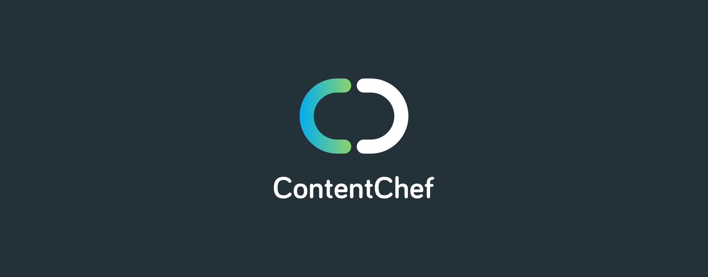

<div align="center">
  
</div>

Content Chef Typescript SDK
===========================

[Content Chef](https://contentchefwebsite)'s polymorphic typescript SDK for your web and node.js applications.

- [Content Chef Typescript SDK](#content-chef-typescript-sdk)
- [Requirements](#requirements)
- [Installation](#installation)
- [API](#api)
  - [ContentChef](#contentchef)
  - [Channels](#channels)

# Requirements

In order to use this SDK, you will need

* An active ContentChef account
* Node.js (v >= 8)

> An IDE/TextEditor with support for TypeScript is highly recommended. 

# Installation

```bash
# install it using npm
npm i --save @contentchef/contentchef-node

# or if you use yarn
yarn add @contentchef/contentchef-node
```

# API

## ContentChef

ContentChef is the default exported function. It is used to configure the SDK with your data.

example

```typescript
import ContentChef from '@contentchef/contentchef-node';

const cf = ContentChef({
  // Your Content Chef apiKey
  apiKey: 'your-content-chef-api-key',
  // Your Content Chef instance domain
  host: 'https://instance.of.contentchef.com/',
  // Will close a pending call after 5 seconds
  timeout: 5000,
});
```

Configuration implements this interface

```typescript
export default interface ISDKConfiguration {
  /**
   * Your Content Chef API key
   * @type {string}
   * @memberof IContentChefConfiguration
   */
  apiKey: string;
  /**
   * Custom agent to perform HTTP requests. 
   * Find further information in the 
   * [axios request config documentation](https://github.com/mzabriskie/axios#request-config).
   * @type {any}
   * @memberof IConfig
   */
  httpAgent?: any;
  /**
   * Custom agent to perform HTTPS requests.
   * Find further information in the 
   * [axios request config documentation](https://github.com/mzabriskie/axios#request-config).
   * @type {any}
   * @memberof IConfig
   */
  httpsAgent?: any;
  /**
   * Content Chef API Endpoint
   * @type {string}
   * @memberof IContentChefConfiguration
   */
  host: string;
  /**
   * Axios proxy configuration. 
   * See the [axios request config documentation](https://github.com/mzabriskie/axios#request-config) 
   * for further information about the supported values.
   * @type {AxiosProxyConfig}
   * @memberof IConfig
   */
  proxy?: AxiosProxyConfig;
  /**
   * Sets a pending request timeout
   * @type {number}
   * @memberof IContentChefConfiguration
   */
  timeout?: number;
}
```

> Bear in mind that `apiKey` and `host` are required

## Channels

A channel is a collector of contents.

The SDK returns two channels: `onlineChannel` and a `previewChannel`.
 
With the `onlineChannel` you can retrieve contents which are in *live* state and which are actually visible, while with the `previewChannel` you can retrieve contents which are in in both *stage* and *live* state and even contents that are not visible in the current date 

Both the `onlineChannel` and the `previewChannel` returns two methods which are *content* and *search*
     
You can use the **content** methods to collect a specific content by it's own `publicId`, to retrieve, for example to retrieve a single post from your blog, a single image from a gallery or a set of articles from your featured articles list.
Otherwise you can use the **search** methods to find content with multiple matching criteria, like content definition name, publishing dates and more.

Example:

```typescript
import ContentChef, { PublishingStatus } from '@contentchef/contentchef-node';

const cf = ContentChef({
  apiKey: 'your-content-chef-api-key',
  host: 'https://instance.of.contentchef.com/',
  timeout: 5000,
});

// This could be the representation of your data
interface IArticle {
  main_image: {
    transformations: string;
    publicId: string;
  };
  sections: Array<{
    name: string;
    value: {
      body: string;
    };
  }>;
  title: string;
}

// opens for example your website channel, will query only published contents in live state in the current date
const websiteOnlineChannel = cf.onlineChannel('website');

// will retrieve from the channel website a single content
websiteOnlineChannel.content<IArticle>({ publicId: 'your-content-id' }).then(response => /* handles response */);

// will retrieve the first 10 contents from the channel website with a specific contentDefinition
websiteOnlineChannel.search<IArticle>({
  contentDefinition: 'featured-articles',
  skip: 0,
  take: 10,
}).then(response => /* handles response */);

// opens your website channel and queries only the published content with a staging state
const websitePreviewChannel = cf.previewChannel('website', PublishingStatus.Staging);

// retrieves a single published content from the channel website with the current date
websitePreviewChannel.content<IArticle>({ publicId: 'your-content-id' }).then(response => /* handles response */);

// retrieves a single published content from the channel website for a desired date as specified in the targetDate param
websitePreviewChannel.content<IArticle>({
  publicId: 'your-content-id',
  // remember, valid dates are expressed using the ISO format like 2019-08-16T12:22:232Z
  targetDate: 'a_date_different_from_now',
}).then(response => /* handles response */);

// retrieves the first 10 contents from the channel website with a specific contentDefinition in another date
websitePreviewChannel.search<IArticle>({
  contentDefinition: 'featured-articles',
  skip: 0,
  take: 10,
}).then(response => /* handles response */);

// retrieves the first 10 contents with a specific contentDefinition from the channel website for a desired date as specified in the targetDate param
websitePreviewChannel.search<IArticle>({
  contentDefinition: 'featured-articles',
  skip: 0,
  take: 10,
  targetDate: 'a_date_different_from_now',
}).then(response => /* handles response */);
```
